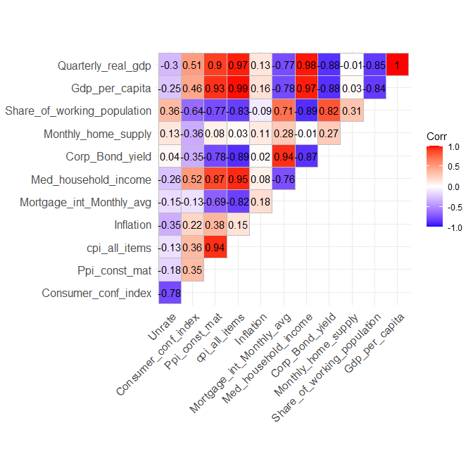
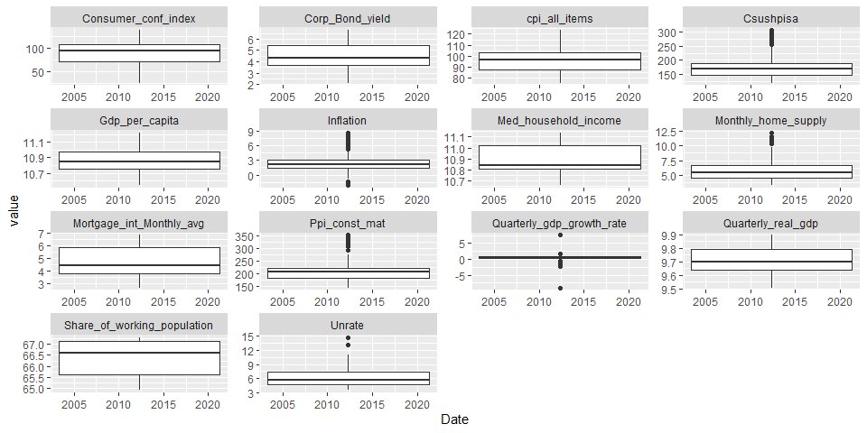
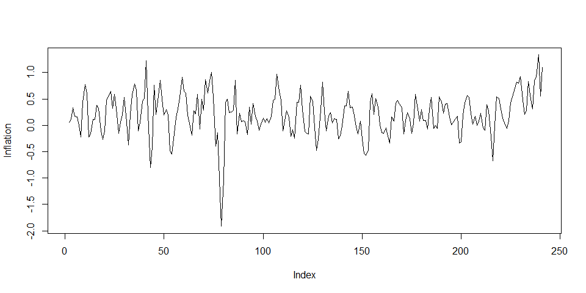
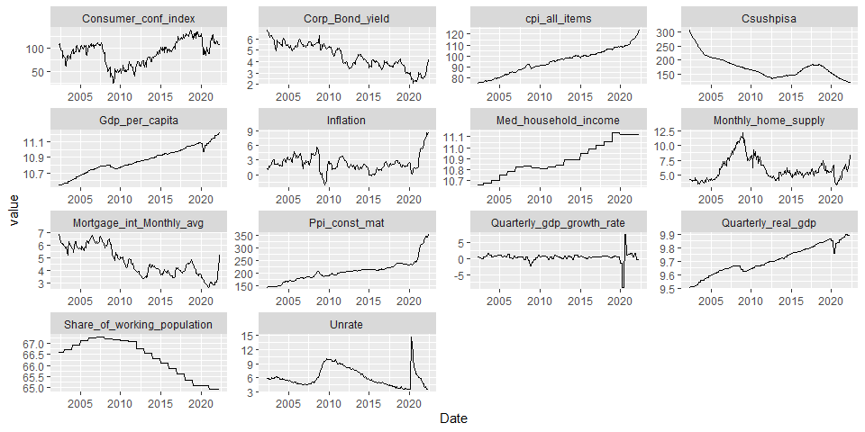
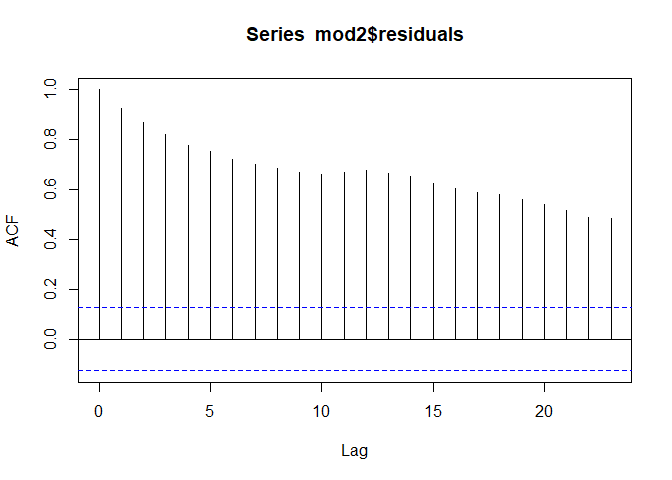
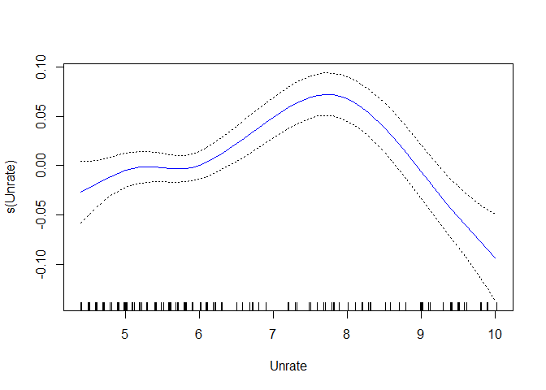
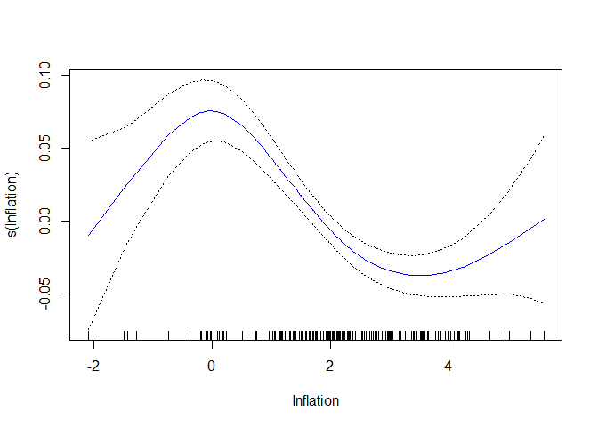
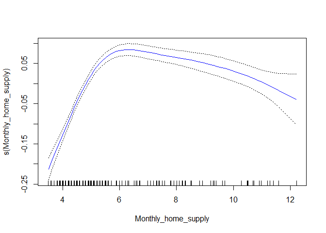
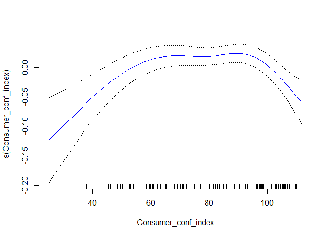

R Notebook
================

link 2
<https://www.kaggle.com/datasets/sagarvarandekar/macroeconomic-factors-affecting-us-housing-prices/code>

This dataset contains month-wise details about all the macro-economic
factors of US over two decades from 05/2002 to 05/2022 which can be used
to determine how different factors affect a particular factor. Sourced
and compiled data from official websites of US government like FRED,
CENSUS, OECD, Conference Board. Collected economic data like Income,
GDP, different indices, mortgage etc. from FRED official website,
demographic data from OECD and consumer confidence Index from Conference
Board.

CONSUMER CONF INDEX - Consumer Confidence Index provided by Conference
Board PPI-CONST MAT - Producers Purchase Index- Construction Materials
CPIALLITEMS - Consumer Price Index- All Items for the US INFLATION(%) -
Inflation rate in the US MORTGAGE INT. MONTHLY AVG(%) - Average Mortgage
interest rate of all Weeks of a particular month MED HOUSEHOLD INCOME -
Median Household Income in the US CORP. BOND YIELD(%) MONTHLY HOME
SUPPLY

``` r
rm(list=ls())
library(tidyverse)
```

    ## ── Attaching core tidyverse packages ──────────────────────── tidyverse 2.0.0 ──
    ## ✔ dplyr     1.1.0     ✔ readr     2.1.4
    ## ✔ forcats   1.0.0     ✔ stringr   1.5.0
    ## ✔ ggplot2   3.4.1     ✔ tibble    3.1.8
    ## ✔ lubridate 1.9.2     ✔ tidyr     1.3.0
    ## ✔ purrr     1.0.1     
    ## ── Conflicts ────────────────────────────────────────── tidyverse_conflicts() ──
    ## ✖ dplyr::filter() masks stats::filter()
    ## ✖ dplyr::lag()    masks stats::lag()
    ## ℹ Use the conflicted package (<http://conflicted.r-lib.org/>) to force all conflicts to become errors

``` r
library(lubridate)
library(zoo)
```

    ## 
    ## Attache Paket: 'zoo'
    ## 
    ## Die folgenden Objekte sind maskiert von 'package:base':
    ## 
    ##     as.Date, as.Date.numeric

``` r
library(skimr)
library(ggcorrplot)
```

    ## Warning: Paket 'ggcorrplot' wurde unter R Version 4.2.3 erstellt

``` r
library(lmtest)
library(sandwich)


setwd("C:/Users/49162/OneDrive/Desktop/All_documents/Kaggle/Bank_marketing")
data_us <- read.csv("DATA.csv")

data_us <- tibble(data_us)
```

``` r
head(data_us)
```

    ## # A tibble: 6 × 15
    ##   DATE   UNRAT…¹ CONSU…² PPI.C…³ CPIAL…⁴ INFLA…⁵ MORTG…⁶ MED.H…⁷ CORP.…⁸ MONTH…⁹
    ##   <chr>    <dbl>   <dbl>   <dbl>   <dbl>   <dbl>   <dbl>   <int>   <dbl>   <dbl>
    ## 1 01-05…     3.6    106.    353.    123.    8.58    5.23      NA    4.13     8.4
    ## 2 01-04…     3.6    107.    344.    122.    8.26    4.98      NA    3.76     8.4
    ## 3 01-03…     3.6    107.    346.    121.    8.54    4.17      NA    3.43     7  
    ## 4 01-02…     3.8    110.    344.    120.    7.87    3.76      NA    3.25     6  
    ## 5 01-01…     4      114.    346.    119.    7.48    3.44      NA    2.93     5.7
    ## 6 01-12…     3.9    116.    335.    118.    7.04    3.10      NA    2.65     5.6
    ## # … with 5 more variables: X..SHARE.OF.WORKING.POPULATION <dbl>,
    ## #   GDP.PER.CAPITA <int>, QUARTERLY.REAL.GDP <dbl>,
    ## #   QUARTERLY.GDP.GROWTH.RATE.... <dbl>, CSUSHPISA <dbl>, and abbreviated
    ## #   variable names ¹​UNRATE..., ²​CONSUMER.CONF.INDEX, ³​PPI.CONST.MAT.,
    ## #   ⁴​CPIALLITEMS, ⁵​INFLATION..., ⁶​MORTGAGE.INT..MONTHLY.AVG...,
    ## #   ⁷​MED.HOUSEHOLD.INCOME, ⁸​CORP..BOND.YIELD..., ⁹​MONTHLY.HOME.SUPPLY

``` r
colnames(data_us)
```

    ##  [1] "DATE"                           "UNRATE..."                     
    ##  [3] "CONSUMER.CONF.INDEX"            "PPI.CONST.MAT."                
    ##  [5] "CPIALLITEMS"                    "INFLATION..."                  
    ##  [7] "MORTGAGE.INT..MONTHLY.AVG..."   "MED.HOUSEHOLD.INCOME"          
    ##  [9] "CORP..BOND.YIELD..."            "MONTHLY.HOME.SUPPLY"           
    ## [11] "X..SHARE.OF.WORKING.POPULATION" "GDP.PER.CAPITA"                
    ## [13] "QUARTERLY.REAL.GDP"             "QUARTERLY.GDP.GROWTH.RATE...." 
    ## [15] "CSUSHPISA"

Renaming the columns

``` r
names <- str_to_title(colnames(data_us))
names
```

    ##  [1] "Date"                           "Unrate..."                     
    ##  [3] "Consumer.conf.index"            "Ppi.const.mat."                
    ##  [5] "Cpiallitems"                    "Inflation..."                  
    ##  [7] "Mortgage.int..Monthly.avg..."   "Med.household.income"          
    ##  [9] "Corp..Bond.yield..."            "Monthly.home.supply"           
    ## [11] "X..Share.of.working.population" "Gdp.per.capita"                
    ## [13] "Quarterly.real.gdp"             "Quarterly.gdp.growth.rate...." 
    ## [15] "Csushpisa"

``` r
new_names <- str_replace_all(names, "[\\.]+", "_")
new_names
```

    ##  [1] "Date"                          "Unrate_"                      
    ##  [3] "Consumer_conf_index"           "Ppi_const_mat_"               
    ##  [5] "Cpiallitems"                   "Inflation_"                   
    ##  [7] "Mortgage_int_Monthly_avg_"     "Med_household_income"         
    ##  [9] "Corp_Bond_yield_"              "Monthly_home_supply"          
    ## [11] "X_Share_of_working_population" "Gdp_per_capita"               
    ## [13] "Quarterly_real_gdp"            "Quarterly_gdp_growth_rate_"   
    ## [15] "Csushpisa"

``` r
new_names1 <- str_replace_all(new_names, c("_$" = "", "^._" = "" ))
new_names1
```

    ##  [1] "Date"                        "Unrate"                     
    ##  [3] "Consumer_conf_index"         "Ppi_const_mat"              
    ##  [5] "Cpiallitems"                 "Inflation"                  
    ##  [7] "Mortgage_int_Monthly_avg"    "Med_household_income"       
    ##  [9] "Corp_Bond_yield"             "Monthly_home_supply"        
    ## [11] "Share_of_working_population" "Gdp_per_capita"             
    ## [13] "Quarterly_real_gdp"          "Quarterly_gdp_growth_rate"  
    ## [15] "Csushpisa"

``` r
writeLines(new_names1)
```

    ## Date
    ## Unrate
    ## Consumer_conf_index
    ## Ppi_const_mat
    ## Cpiallitems
    ## Inflation
    ## Mortgage_int_Monthly_avg
    ## Med_household_income
    ## Corp_Bond_yield
    ## Monthly_home_supply
    ## Share_of_working_population
    ## Gdp_per_capita
    ## Quarterly_real_gdp
    ## Quarterly_gdp_growth_rate
    ## Csushpisa

``` r
#new_names <- str_sub(new_names,1,15)
colnames(data_us) <- new_names1
colnames(data_us)
```

    ##  [1] "Date"                        "Unrate"                     
    ##  [3] "Consumer_conf_index"         "Ppi_const_mat"              
    ##  [5] "Cpiallitems"                 "Inflation"                  
    ##  [7] "Mortgage_int_Monthly_avg"    "Med_household_income"       
    ##  [9] "Corp_Bond_yield"             "Monthly_home_supply"        
    ## [11] "Share_of_working_population" "Gdp_per_capita"             
    ## [13] "Quarterly_real_gdp"          "Quarterly_gdp_growth_rate"  
    ## [15] "Csushpisa"

``` r
str(data_us)
```

    ## tibble [241 × 15] (S3: tbl_df/tbl/data.frame)
    ##  $ Date                       : chr [1:241] "01-05-2022" "01-04-2022" "01-03-2022" "01-02-2022" ...
    ##  $ Unrate                     : num [1:241] 3.6 3.6 3.6 3.8 4 3.9 4.2 4.6 4.7 5.2 ...
    ##  $ Consumer_conf_index        : num [1:241] 106 107 107 110 114 ...
    ##  $ Ppi_const_mat              : num [1:241] 353 344 346 344 346 ...
    ##  $ Cpiallitems                : num [1:241] 123 122 121 120 119 ...
    ##  $ Inflation                  : num [1:241] 8.58 8.26 8.54 7.87 7.48 ...
    ##  $ Mortgage_int_Monthly_avg   : num [1:241] 5.23 4.98 4.17 3.76 3.44 ...
    ##  $ Med_household_income       : int [1:241] NA NA NA NA NA NA NA NA NA NA ...
    ##  $ Corp_Bond_yield            : num [1:241] 4.13 3.76 3.43 3.25 2.93 2.65 2.62 2.68 2.53 2.55 ...
    ##  $ Monthly_home_supply        : num [1:241] 8.4 8.4 7 6 5.7 5.6 6.2 6.9 6.1 6.5 ...
    ##  $ Share_of_working_population: num [1:241] NA NA NA NA NA ...
    ##  $ Gdp_per_capita             : int [1:241] 74737 74737 73289 73289 73289 72171 72171 72171 69824 69824 ...
    ##  $ Quarterly_real_gdp         : num [1:241] 19699 19699 19728 19728 19728 ...
    ##  $ Quarterly_gdp_growth_rate  : num [1:241] -0.144 -0.144 -0.396 -0.396 -0.396 ...
    ##  $ Csushpisa                  : num [1:241] 121 122 123 124 125 ...

``` r
#for(i in seq_along(data_us)){
 # data_us$date[[i]]<- dd_date(data_us$date[[i]])
#}
data_us$Date <- dmy(data_us$Date)
str(data_us)
```

    ## tibble [241 × 15] (S3: tbl_df/tbl/data.frame)
    ##  $ Date                       : Date[1:241], format: "2022-05-01" "2022-04-01" ...
    ##  $ Unrate                     : num [1:241] 3.6 3.6 3.6 3.8 4 3.9 4.2 4.6 4.7 5.2 ...
    ##  $ Consumer_conf_index        : num [1:241] 106 107 107 110 114 ...
    ##  $ Ppi_const_mat              : num [1:241] 353 344 346 344 346 ...
    ##  $ Cpiallitems                : num [1:241] 123 122 121 120 119 ...
    ##  $ Inflation                  : num [1:241] 8.58 8.26 8.54 7.87 7.48 ...
    ##  $ Mortgage_int_Monthly_avg   : num [1:241] 5.23 4.98 4.17 3.76 3.44 ...
    ##  $ Med_household_income       : int [1:241] NA NA NA NA NA NA NA NA NA NA ...
    ##  $ Corp_Bond_yield            : num [1:241] 4.13 3.76 3.43 3.25 2.93 2.65 2.62 2.68 2.53 2.55 ...
    ##  $ Monthly_home_supply        : num [1:241] 8.4 8.4 7 6 5.7 5.6 6.2 6.9 6.1 6.5 ...
    ##  $ Share_of_working_population: num [1:241] NA NA NA NA NA ...
    ##  $ Gdp_per_capita             : int [1:241] 74737 74737 73289 73289 73289 72171 72171 72171 69824 69824 ...
    ##  $ Quarterly_real_gdp         : num [1:241] 19699 19699 19728 19728 19728 ...
    ##  $ Quarterly_gdp_growth_rate  : num [1:241] -0.144 -0.144 -0.396 -0.396 -0.396 ...
    ##  $ Csushpisa                  : num [1:241] 121 122 123 124 125 ...

``` r
data_us <- data_us%>% arrange(Date)
head(data_us)
```

    ## # A tibble: 6 × 15
    ##   Date       Unrate Consumer_c…¹ Ppi_c…² Cpial…³ Infla…⁴ Mortg…⁵ Med_h…⁶ Corp_…⁷
    ##   <date>      <dbl>        <dbl>   <dbl>   <dbl>   <dbl>   <dbl>   <int>   <dbl>
    ## 1 2002-05-01    5.8        108.     144.    75.9    1.18    6.81   42409    6.75
    ## 2 2002-06-01    5.8        110.     144.    75.9    1.07    6.65   42409    6.63
    ## 3 2002-07-01    5.8        106.     145.    76.0    1.46    6.48   42409    6.53
    ## 4 2002-08-01    5.7         97.4    145.    76.2    1.80    6.29   42409    6.37
    ## 5 2002-09-01    5.7         94.5    145.    76.4    1.51    6.09   42409    6.15
    ## 6 2002-10-01    5.7         93.7    145     76.5    2.03    6.11   42409    6.32
    ## # … with 6 more variables: Monthly_home_supply <dbl>,
    ## #   Share_of_working_population <dbl>, Gdp_per_capita <int>,
    ## #   Quarterly_real_gdp <dbl>, Quarterly_gdp_growth_rate <dbl>, Csushpisa <dbl>,
    ## #   and abbreviated variable names ¹​Consumer_conf_index, ²​Ppi_const_mat,
    ## #   ³​Cpiallitems, ⁴​Inflation, ⁵​Mortgage_int_Monthly_avg, ⁶​Med_household_income,
    ## #   ⁷​Corp_Bond_yield

``` r
apply(is.na(data_us), 2, sum)
```

    ##                        Date                      Unrate 
    ##                           0                           0 
    ##         Consumer_conf_index               Ppi_const_mat 
    ##                           0                           0 
    ##                 Cpiallitems                   Inflation 
    ##                           0                           0 
    ##    Mortgage_int_Monthly_avg        Med_household_income 
    ##                           0                          17 
    ##             Corp_Bond_yield         Monthly_home_supply 
    ##                           0                           0 
    ## Share_of_working_population              Gdp_per_capita 
    ##                           5                           0 
    ##          Quarterly_real_gdp   Quarterly_gdp_growth_rate 
    ##                           0                           0 
    ##                   Csushpisa 
    ##                           0

``` r
tail(data_us, 20)
```

    ## # A tibble: 20 × 15
    ##    Date       Unrate Consumer_…¹ Ppi_c…² Cpial…³ Infla…⁴ Mortg…⁵ Med_h…⁶ Corp_…⁷
    ##    <date>      <dbl>       <dbl>   <dbl>   <dbl>   <dbl>   <dbl>   <int>   <dbl>
    ##  1 2020-10-01    6.9       101.     246.    110.    1.18    2.83   67521    2.35
    ##  2 2020-11-01    6.7        96.1    244.    110.    1.17    2.76   67521    2.3 
    ##  3 2020-12-01    6.7        88.6    248     110.    1.36    2.68   67521    2.26
    ##  4 2021-01-01    6.4        89.3    256.    110.    1.40    2.74      NA    2.45
    ##  5 2021-02-01    6.2        91.3    265.    111.    1.68    2.81      NA    2.7 
    ##  6 2021-03-01    6         110.     277.    112.    2.62    3.08      NA    3.04
    ##  7 2021-04-01    6         122.     292.    113.    4.16    3.06      NA    2.9 
    ##  8 2021-05-01    5.8       117.     306.    114.    4.99    2.96      NA    2.96
    ##  9 2021-06-01    5.9       127.     316.    115.    5.39    2.98      NA    2.79
    ## 10 2021-07-01    5.4       129.     314.    115.    5.37    2.87      NA    2.57
    ## 11 2021-08-01    5.2       114.     313.    115.    5.25    2.84      NA    2.55
    ## 12 2021-09-01    4.7       109.     317.    116.    5.39    2.9       NA    2.53
    ## 13 2021-10-01    4.6       114.     322.    117.    6.22    3.07      NA    2.68
    ## 14 2021-11-01    4.2       110.     329.    117.    6.81    3.07      NA    2.62
    ## 15 2021-12-01    3.9       116.     335.    118.    7.04    3.10      NA    2.65
    ## 16 2022-01-01    4         114.     346.    119.    7.48    3.44      NA    2.93
    ## 17 2022-02-01    3.8       110.     344.    120.    7.87    3.76      NA    3.25
    ## 18 2022-03-01    3.6       107.     346.    121.    8.54    4.17      NA    3.43
    ## 19 2022-04-01    3.6       107.     344.    122.    8.26    4.98      NA    3.76
    ## 20 2022-05-01    3.6       106.     353.    123.    8.58    5.23      NA    4.13
    ## # … with 6 more variables: Monthly_home_supply <dbl>,
    ## #   Share_of_working_population <dbl>, Gdp_per_capita <int>,
    ## #   Quarterly_real_gdp <dbl>, Quarterly_gdp_growth_rate <dbl>, Csushpisa <dbl>,
    ## #   and abbreviated variable names ¹​Consumer_conf_index, ²​Ppi_const_mat,
    ## #   ³​Cpiallitems, ⁴​Inflation, ⁵​Mortgage_int_Monthly_avg, ⁶​Med_household_income,
    ## #   ⁷​Corp_Bond_yield

``` r
attach(data_us)
data_us <- na.locf(data_us, fromLast = FALSE)

apply(is.na(data_us), 2, sum)
```

    ##                        Date                      Unrate 
    ##                           0                           0 
    ##         Consumer_conf_index               Ppi_const_mat 
    ##                           0                           0 
    ##                 Cpiallitems                   Inflation 
    ##                           0                           0 
    ##    Mortgage_int_Monthly_avg        Med_household_income 
    ##                           0                           0 
    ##             Corp_Bond_yield         Monthly_home_supply 
    ##                           0                           0 
    ## Share_of_working_population              Gdp_per_capita 
    ##                           0                           0 
    ##          Quarterly_real_gdp   Quarterly_gdp_growth_rate 
    ##                           0                           0 
    ##                   Csushpisa 
    ##                           0

``` r
#data_us <- data_us %>% select(!date)

#data_us <- as_tibble(data_us)
#head(data_us)

data_us <- data_us %>% rename(cpi_all_items = Cpiallitems)

library(GrowthRate)

GrowthRate <- function(x){
  y = (x - (dplyr::lag(x)))/dplyr::lag(x)
  return(y*100)
}

Inflation <- GrowthRate(data_us$cpi_all_items)
```

``` r
for(i in seq_along(data_us)){
  data_us[[i]]<- round(data_us[[i]],3)
}

head(data_us)
```

    ## # A tibble: 6 × 15
    ##   Date       Unrate Consumer_c…¹ Ppi_c…² cpi_a…³ Infla…⁴ Mortg…⁵ Med_h…⁶ Corp_…⁷
    ##   <date>      <dbl>        <dbl>   <dbl>   <dbl>   <dbl>   <dbl>   <dbl>   <dbl>
    ## 1 2002-05-01    5.8        108.     144.    75.9    1.18    6.81   42409    6.75
    ## 2 2002-06-01    5.8        110.     144.    75.9    1.07    6.65   42409    6.63
    ## 3 2002-07-01    5.8        106.     145.    76.0    1.46    6.48   42409    6.53
    ## 4 2002-08-01    5.7         97.4    145.    76.2    1.80    6.29   42409    6.37
    ## 5 2002-09-01    5.7         94.5    145.    76.4    1.51    6.09   42409    6.15
    ## 6 2002-10-01    5.7         93.7    145     76.5    2.03    6.11   42409    6.32
    ## # … with 6 more variables: Monthly_home_supply <dbl>,
    ## #   Share_of_working_population <dbl>, Gdp_per_capita <dbl>,
    ## #   Quarterly_real_gdp <dbl>, Quarterly_gdp_growth_rate <dbl>, Csushpisa <dbl>,
    ## #   and abbreviated variable names ¹​Consumer_conf_index, ²​Ppi_const_mat,
    ## #   ³​cpi_all_items, ⁴​Inflation, ⁵​Mortgage_int_Monthly_avg,
    ## #   ⁶​Med_household_income, ⁷​Corp_Bond_yield

``` r
for(i in seq_along(data_us[,c(8,12,13)])){
  data_us[,c(8,12,13)][[i]] <- round(log(data_us[,c(8,12,13)][[i]]),3)
}
head(data_us)
```

    ## # A tibble: 6 × 15
    ##   Date       Unrate Consumer_c…¹ Ppi_c…² cpi_a…³ Infla…⁴ Mortg…⁵ Med_h…⁶ Corp_…⁷
    ##   <date>      <dbl>        <dbl>   <dbl>   <dbl>   <dbl>   <dbl>   <dbl>   <dbl>
    ## 1 2002-05-01    5.8        108.     144.    75.9    1.18    6.81    10.7    6.75
    ## 2 2002-06-01    5.8        110.     144.    75.9    1.07    6.65    10.7    6.63
    ## 3 2002-07-01    5.8        106.     145.    76.0    1.46    6.48    10.7    6.53
    ## 4 2002-08-01    5.7         97.4    145.    76.2    1.80    6.29    10.7    6.37
    ## 5 2002-09-01    5.7         94.5    145.    76.4    1.51    6.09    10.7    6.15
    ## 6 2002-10-01    5.7         93.7    145     76.5    2.03    6.11    10.7    6.32
    ## # … with 6 more variables: Monthly_home_supply <dbl>,
    ## #   Share_of_working_population <dbl>, Gdp_per_capita <dbl>,
    ## #   Quarterly_real_gdp <dbl>, Quarterly_gdp_growth_rate <dbl>, Csushpisa <dbl>,
    ## #   and abbreviated variable names ¹​Consumer_conf_index, ²​Ppi_const_mat,
    ## #   ³​cpi_all_items, ⁴​Inflation, ⁵​Mortgage_int_Monthly_avg,
    ## #   ⁶​Med_household_income, ⁷​Corp_Bond_yield

``` r
#data_us <- data_us %>% select(DATE, quarterlygdpgro, quarterlyrealgd, everything())

#data_dep <- data_us %>% select(DATE, quarterlygdpgro, inflation) 
#data_ind <- data_us%>% select(!c(quarterlygdpgro,inflation,DATE))
  

#data_master <- cbind(data_dep, data_ind)
#head(data_master)
```

dealing with outliers

``` r
summary(data_us)
```

    ##       Date                Unrate       Consumer_conf_index Ppi_const_mat  
    ##  Min.   :2002-05-01   Min.   : 3.500   Min.   : 25.00      Min.   :143.8  
    ##  1st Qu.:2007-05-01   1st Qu.: 4.700   1st Qu.: 70.40      1st Qu.:183.3  
    ##  Median :2012-05-01   Median : 5.600   Median : 94.50      Median :206.2  
    ##  Mean   :2012-05-01   Mean   : 6.075   Mean   : 90.81      Mean   :206.9  
    ##  3rd Qu.:2017-05-01   3rd Qu.: 7.300   3rd Qu.:108.20      3rd Qu.:221.7  
    ##  Max.   :2022-05-01   Max.   :14.700   Max.   :138.40      Max.   :352.9  
    ##  cpi_all_items      Inflation      Mortgage_int_Monthly_avg
    ##  Min.   : 75.86   Min.   :-2.097   Min.   :2.684           
    ##  1st Qu.: 87.72   1st Qu.: 1.464   1st Qu.:3.803           
    ##  Median : 96.82   Median : 2.071   Median :4.457           
    ##  Mean   : 95.54   Mean   : 2.296   Mean   :4.698           
    ##  3rd Qu.:103.25   3rd Qu.: 2.970   3rd Qu.:5.812           
    ##  Max.   :123.32   Max.   : 8.582   Max.   :6.806           
    ##  Med_household_income Corp_Bond_yield Monthly_home_supply
    ##  Min.   :10.65        Min.   :2.140   Min.   : 3.300     
    ##  1st Qu.:10.80        1st Qu.:3.690   1st Qu.: 4.600     
    ##  Median :10.84        Median :4.340   Median : 5.500     
    ##  Mean   :10.89        Mean   :4.471   Mean   : 5.974     
    ##  3rd Qu.:11.02        3rd Qu.:5.410   3rd Qu.: 6.700     
    ##  Max.   :11.14        Max.   :6.750   Max.   :12.200     
    ##  Share_of_working_population Gdp_per_capita  Quarterly_real_gdp
    ##  Min.   :64.92               Min.   :10.54   Min.   :9.509     
    ##  1st Qu.:65.62               1st Qu.:10.76   1st Qu.:9.636     
    ##  Median :66.59               Median :10.85   Median :9.696     
    ##  Mean   :66.38               Mean   :10.86   Mean   :9.708     
    ##  3rd Qu.:67.12               3rd Qu.:10.98   3rd Qu.:9.792     
    ##  Max.   :67.30               Max.   :11.22   Max.   :9.894     
    ##  Quarterly_gdp_growth_rate   Csushpisa    
    ##  Min.   :-8.9370           Min.   :120.7  
    ##  1st Qu.: 0.2940           1st Qu.:147.4  
    ##  Median : 0.5800           Median :169.8  
    ##  Mean   : 0.4901           Mean   :175.3  
    ##  3rd Qu.: 0.8340           3rd Qu.:189.7  
    ##  Max.   : 7.5480           Max.   :304.8

``` r
#gdp_bar <- quantile(data_master$quarterlygdpgro, 0.98)

#inflation_bar <- quantile(data_master$inflation, 0.99)


#rescaled <- function(x){  ifelse(x>gdp_bar,gdp_bar,x)}


#for (i in seq_along(data_master$quarterlygdpgro)){
#  data_master$quarterlygdpgro[[i]] <- rescaled(data_master$quarterlygdpgro[[i]])
#}


#data_master[-1]%>%map_dbl(median)
```

Correlation matrix

``` r
corr_us <- cor(data_us[,2:13])


ggcorrplot(corr_us,lab = TRUE,type = "upper")
```



``` r
data_pivot <- data_us %>% pivot_longer(-Date, names_to = "variables", values_to="value")

ggplot(data_pivot, aes(Date,value)) + geom_boxplot() +facet_wrap("variables", scale= "free")
```

    ## Warning: Continuous x aesthetic
    ## ℹ did you forget `aes(group = ...)`?



``` r
Infl <- data_us%>% select(Date, cpi_all_items)

growth <- function(x){
    (x - dplyr::lag(x))/ dplyr::lag(x)
}


Infl <- Infl %>% mutate(Inflation = growth(cpi_all_items))

plot(Inflation, type="l")
```



``` r
ggplot(data_pivot, aes(Date,value)) + geom_line() +facet_wrap("variables", scale= "free")
```



OLS

``` r
data_us <- data_us %>% select(!c(Quarterly_real_gdp,
                                 Quarterly_gdp_growth_rate))

data_us1 <- data_us %>% select(!Date)

mod1 <- lm(Gdp_per_capita ~ ., data=data_us1)

summary(mod1)
```

    ## 
    ## Call:
    ## lm(formula = Gdp_per_capita ~ ., data = data_us1)
    ## 
    ## Residuals:
    ##       Min        1Q    Median        3Q       Max 
    ## -0.042264 -0.005870 -0.000301  0.005515  0.027433 
    ## 
    ## Coefficients:
    ##                               Estimate Std. Error t value Pr(>|t|)    
    ## (Intercept)                  5.685e+00  5.720e-01   9.939  < 2e-16 ***
    ## Unrate                      -8.312e-03  5.530e-04 -15.030  < 2e-16 ***
    ## Consumer_conf_index          3.910e-04  6.416e-05   6.095 4.60e-09 ***
    ## Ppi_const_mat                2.540e-04  7.254e-05   3.501 0.000557 ***
    ## cpi_all_items                9.044e-03  4.639e-04  19.494  < 2e-16 ***
    ## Inflation                   -1.676e-03  6.746e-04  -2.485 0.013683 *  
    ## Mortgage_int_Monthly_avg    -4.597e-03  2.633e-03  -1.746 0.082132 .  
    ## Med_household_income         3.008e-01  3.106e-02   9.683  < 2e-16 ***
    ## Corp_Bond_yield             -4.827e-03  2.926e-03  -1.650 0.100391    
    ## Monthly_home_supply          1.933e-03  7.662e-04   2.523 0.012301 *  
    ## Share_of_working_population  1.645e-02  4.703e-03   3.497 0.000566 ***
    ## Csushpisa                   -3.203e-04  7.336e-05  -4.366 1.92e-05 ***
    ## ---
    ## Signif. codes:  0 '***' 0.001 '**' 0.01 '*' 0.05 '.' 0.1 ' ' 1
    ## 
    ## Residual standard error: 0.009229 on 229 degrees of freedom
    ## Multiple R-squared:  0.9971, Adjusted R-squared:  0.9969 
    ## F-statistic:  7058 on 11 and 229 DF,  p-value: < 2.2e-16

``` r
library(car)
```

    ## Lade nötiges Paket: carData

    ## 
    ## Attache Paket: 'car'

    ## Das folgende Objekt ist maskiert 'package:dplyr':
    ## 
    ##     recode

    ## Das folgende Objekt ist maskiert 'package:purrr':
    ## 
    ##     some

``` r
vif(mod1) # Variance 
```

    ##                      Unrate         Consumer_conf_index 
    ##                    3.402481                    7.762133 
    ##               Ppi_const_mat               cpi_all_items 
    ##                   24.295042                   74.547239 
    ##                   Inflation    Mortgage_int_Monthly_avg 
    ##                    3.455442                   24.493385 
    ##        Med_household_income             Corp_Bond_yield 
    ##                   57.850643                   28.093340 
    ##         Monthly_home_supply Share_of_working_population 
    ##                    5.945118                   42.155519 
    ##                   Csushpisa 
    ##                   20.512002

``` r
mod2 <- lm(Gdp_per_capita ~ Unrate+ Inflation+ Monthly_home_supply+
             Consumer_conf_index , data = data_us )
summary(mod2)
```

    ## 
    ## Call:
    ## lm(formula = Gdp_per_capita ~ Unrate + Inflation + Monthly_home_supply + 
    ##     Consumer_conf_index, data = data_us)
    ## 
    ## Residuals:
    ##      Min       1Q   Median       3Q      Max 
    ## -0.36530 -0.13585  0.03847  0.10121  0.29324 
    ## 
    ## Coefficients:
    ##                      Estimate Std. Error t value Pr(>|t|)    
    ## (Intercept)         9.9822610  0.1136461  87.836  < 2e-16 ***
    ## Unrate              0.0348617  0.0077335   4.508 1.03e-05 ***
    ## Inflation           0.0088008  0.0059376   1.482     0.14    
    ## Monthly_home_supply 0.0240950  0.0053225   4.527 9.49e-06 ***
    ## Consumer_conf_index 0.0055508  0.0006106   9.091  < 2e-16 ***
    ## ---
    ## Signif. codes:  0 '***' 0.001 '**' 0.01 '*' 0.05 '.' 0.1 ' ' 1
    ## 
    ## Residual standard error: 0.1391 on 236 degrees of freedom
    ## Multiple R-squared:  0.3117, Adjusted R-squared:  0.3001 
    ## F-statistic: 26.72 on 4 and 236 DF,  p-value: < 2.2e-16

``` r
#acf(mod2$residuals)
```

``` r
vif(mod2)
```

    ##              Unrate           Inflation Monthly_home_supply Consumer_conf_index 
    ##            2.929929            1.178874            1.263220            3.096271

``` r
coeftest(mod2, vcov = vcovHC)
```

    ## 
    ## t test of coefficients:
    ## 
    ##                       Estimate Std. Error t value  Pr(>|t|)    
    ## (Intercept)         9.98226099 0.11485769 86.9098 < 2.2e-16 ***
    ## Unrate              0.03486166 0.00715575  4.8718 2.028e-06 ***
    ## Inflation           0.00880085 0.00723328  1.2167    0.2249    
    ## Monthly_home_supply 0.02409502 0.00538205  4.4769 1.179e-05 ***
    ## Consumer_conf_index 0.00555075 0.00055715  9.9628 < 2.2e-16 ***
    ## ---
    ## Signif. codes:  0 '***' 0.001 '**' 0.01 '*' 0.05 '.' 0.1 ' ' 1

``` r
acf(mod2$residuals)
```

<!-- -->

################################################################# 

### Train and test set

################################################## 

``` r
dim(data_us)[1] * 0.7 
```

    ## [1] 168.7

``` r
test_data <- data_us %>% filter(Date >= "2016-04-01")
train_data <- data_us %>% filter(Date < "2016-04-01")
```

## Linear Model (OLS)

``` r
mod_lm <- lm(Gdp_per_capita ~ Unrate+ Inflation+ Monthly_home_supply+
             Consumer_conf_index , data = train_data )
summary(mod_lm)
```

    ## 
    ## Call:
    ## lm(formula = Gdp_per_capita ~ Unrate + Inflation + Monthly_home_supply + 
    ##     Consumer_conf_index, data = train_data)
    ## 
    ## Residuals:
    ##       Min        1Q    Median        3Q       Max 
    ## -0.242681 -0.063132 -0.007456  0.093924  0.171793 
    ## 
    ## Coefficients:
    ##                       Estimate Std. Error t value Pr(>|t|)    
    ## (Intercept)         10.5967936  0.1388848  76.299  < 2e-16 ***
    ## Unrate               0.0109885  0.0094255   1.166  0.24540    
    ## Inflation           -0.0203549  0.0062832  -3.240  0.00145 ** 
    ## Monthly_home_supply  0.0138790  0.0046178   3.006  0.00307 ** 
    ## Consumer_conf_index  0.0007940  0.0008015   0.991  0.32334    
    ## ---
    ## Signif. codes:  0 '***' 0.001 '**' 0.01 '*' 0.05 '.' 0.1 ' ' 1
    ## 
    ## Residual standard error: 0.1058 on 162 degrees of freedom
    ## Multiple R-squared:  0.1328, Adjusted R-squared:  0.1114 
    ## F-statistic: 6.204 on 4 and 162 DF,  p-value: 0.000114

#### Training and test error

``` r
#MSE_lm <-mean((train_data$Gdp_per_capita - mod_lm$fitted.values)^2)
#MSE_lm

MSE_train <- mean(mod_lm$residuals^2)


mod_pred <- predict(mod_lm, newdata = test_data)

MSE_test <- mean((test_data$Gdp_per_capita - mod_pred)^2)


data.frame(cbind(MSE_train, MSE_test))
```

    ##    MSE_train  MSE_test
    ## 1 0.01084924 0.0983211

Non-linear model (Regression Splines)

``` r
library(splines)
library(gam)
```

    ## Warning: Paket 'gam' wurde unter R Version 4.2.3 erstellt

    ## Lade nötiges Paket: foreach

    ## 
    ## Attache Paket: 'foreach'

    ## Die folgenden Objekte sind maskiert von 'package:purrr':
    ## 
    ##     accumulate, when

    ## Loaded gam 1.22-2

``` r
#mod_cs <- lm(Gdp_per_capita ~ ns(Unrate,4)+ ns(Inflation,4)+
#               ns(Monthly_home_supply,4)+
#             ns(Consumer_conf_index,4) , data = data_us )


mod_ss <- gam(Gdp_per_capita ~ s(Unrate)+ s(Inflation)+
               s(Monthly_home_supply)+
             s(Consumer_conf_index),  data = train_data)

names(mod_ss)
```

    ##  [1] "smooth.frame"        "coefficients"        "residuals"          
    ##  [4] "fitted.values"       "effects"             "weights"            
    ##  [7] "rank"                "assign"              "qr"                 
    ## [10] "smooth"              "nl.df"               "df.residual"        
    ## [13] "iter"                "var"                 "additive.predictors"
    ## [16] "R"                   "rank"                "family"             
    ## [19] "deviance"            "aic"                 "null.deviance"      
    ## [22] "iter"                "bf.iter"             "prior.weights"      
    ## [25] "y"                   "df.null"             "nl.chisq"           
    ## [28] "model"               "call"                "formula"            
    ## [31] "terms"               "data"                "offset"             
    ## [34] "control"             "method"              "contrasts"          
    ## [37] "xlevels"

``` r
plot.Gam(mod_ss, col = "blue", se=TRUE)
```

<!-- --><!-- --><!-- --><!-- -->

``` r
MSE_ss <- mean(mod_ss$residuals^2)
MSE_ss  ## Train error
```

    ## [1] 0.002616117

``` r
pred_ss <- predict(mod_ss, newdata = test_data)

MSE_ss_test <- mean((test_data$Gdp_per_capita - pred_ss)^2)
MSE_ss_test  ### Test error
```

    ## [1] 0.1503257

``` r
erro <- data.frame(cbind(MSE_ss,MSE_ss_test))
colnames(erro) <- c("MSE train data", "MSE test data")
```
